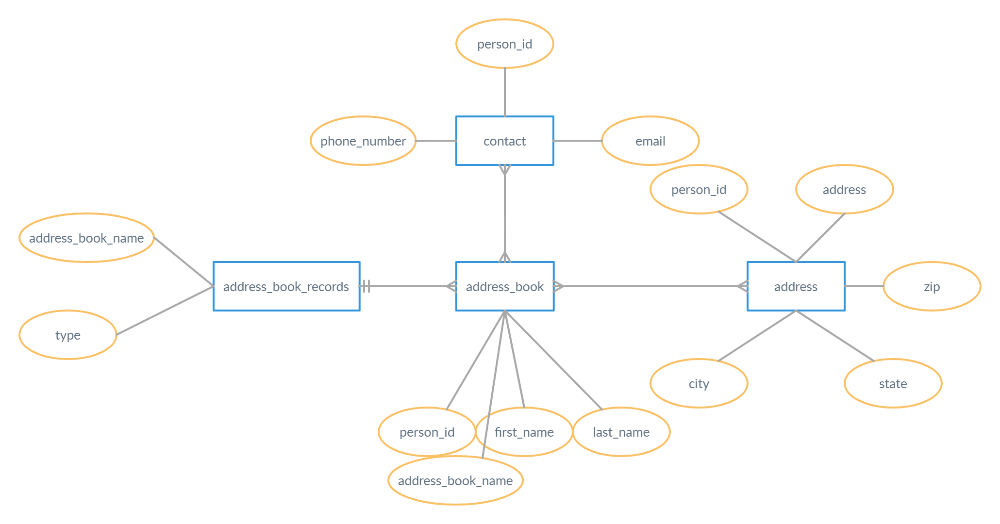

# address-book-sql
## UC1_Create_AddressBookServiceDB
```
CREATE DATABASE address_book_service;
SHOW DATABASES;
USE address_book_service;
```
## UC2_Create_AddressBookTable
```
CREATE TABLE address_book (
id              INT unsigned NOT NULL AUTO_INCREMENT,
first_name      VARCHAR(20) NOT NULL,
last_name       VARCHAR(20),
address         VARCHAR(200) NOT NULL,
city            VARCHAR(20) NOT NULL,
state           VARCHAR(20) NOT NULL,
zip             VARCHAR(6) NOT NULL,
phone_number    VARCHAR(10) NOT NULL,
email           VARCHAR(20) NOT NULL,
PRIMARY KEY (id)
);
```
## UC3_InsertDataInto_AddressBookTable
```
INSERT INTO address_book (first_name, last_name, address, city, state, zip, phone_number, email) VALUES
   ('Akram','Shaheed','Berhampore','Kolkata','West Bengal','742100','9999900000','first@person.com'),
   ('Aditi','Sharma','4/11 Vati Nagar','Thane','Maharashtra','625058','8888888888', 'sec@person.com'),
   ('John','Smith','8/22 Kalyani','Kalyani','West Bengal','729558','8123400000','third@person.com'),
   ('Krishna','Pauly','8/11 Podula Road','Aluva','Kerala','826123','7894652222','fourth@person.com');
```
## UC4_EditData_UsingName
```
UPDATE address_book set email = 'akram007@gmai.com'
   WHERE first_name = 'Akram' AND last_name = 'Shaheed';
```
## UC5_DeletePerson_UsingName
#### Adding a dummy person and later deleting it using name
```
INSERT INTO address_book (first_name, last_name, address, city, state, zip, phone_number, email) VALUES
   ('Dummy','Person','Berhampore','Kolkata','West Bengal','742100','9999900000','dummy@person.com');
```
```DELETE FROM ADDRESS_BOOK WHERE FIRST_NAME = 'Dummy' AND LAST_NAME = 'Person';```
## UC6_RetrievePerson_FromCityState
```
SELECT * FROM address_book WHERE city = 'Aluva';
SELECT * FROM address_book WHERE state = 'West Bengal';
```
## UC7_SizeBy_CityOrState
```
SELECT city, COUNT(city) FROM address_book GROUP BY city;
SELECT state, COUNT(state) FROM address_book GROUP BY state;
```
## UC8_SortedByName_ForACity
#### Adding this dummy person to chcek the result after sorting by name;
```
INSERT INTO address_book (first_name, last_name, address, city, state, zip, phone_number, email) VALUES
   ('Dummy','Person','Berhampore','Kalyani','West Bengal','742100','9999900000','dummy@person.com');
```
#### Sorted by person's name for city 'Kalyani'
```SELECT * FROM address_book WHERE city = 'Kalyani' ORDER BY first_name, last_name;```
## UC9_Add_NameAndType
#### Adding address book name and type
```
ALTER TABLE address_book ADD type VARCHAR(20) AFTER last_name;
ALTER TABLE address_book ADD address_book_name VARCHAR(20) AFTER last_name;
```
#### Inserting types for each contact
```
UPDATE address_book SET type = 'Friend'
   WHERE first_name IN ('Aditi', 'Dummy', 'Krishna') AND last_name IN ('Sharma', 'Person', 'Pauly');
  
UPDATE address_book SET type = 'Family'
   WHERE first_name IN ('Akram') AND last_name IN ('Shaheed');
   
UPDATE address_book SET type = 'Office'
   WHERE first_name IN ('John') AND last_name IN ('Smith');
```
#### Adding address_book_name accordingly
```UPDATE address_book SET address_book_name = CONCAT(LOWER(type),'_book');```
## UC10_NoOfContactPerType
```SELECT type, COUNT(id) FROM address_book GROUP BY type;```
## UC11_AddContactIn_AllTypes
```
INSERT INTO address_book (first_name, last_name, address_book_name, type, address, city, state, zip, phone_number, email) VALUES
   ('Dummy','Person','family_book',Family','Berhampore','Kalyani','West Bengal','742100','9999900000','dummy@person.com');
   
INSERT INTO address_book (first_name, last_name, address_book_name, type, address, city, state, zip, phone_number, email) VALUES
   ('Dummy','Person','friend_book','Friend','Berhampore','Kalyani','West Bengal','742100','9999905500','dummy@person.com');
```
## UC12_ERDiagram_ForAdressBookServiceDB
#### ER Diagram for ADDRESS BOOK PROBLEM

#### Add seperate table for address_book_name and types
```
CREATE TABLE address_book_records (
   address_book_name VARCHAR(20) NOT NULL,
   type VARCHAR(20) NOT NULL,
   PRIMARY KEY (address_book_name)
);

INSERT INTO address_book_records (address_book_name,type) VALUES
   ('family_book','Family'),
   ('friend_book','Friend'),
   ('office_book','Office');
```
#### Add person_id and make it PK and address_book_name as FK
```
ALTER TABLE address_book ADD person_id INT NOT NULL AFTER id;
UPDATE TABLE address_book SET person_id=ID+1000;
DELETE FROM address_book WHERE id = 1008;
ALTER TABLE address_book DROP id;
ALTER TABLE address_book ADD PRIMARY KEY (person_id);
ALTER TABLE address_book ADD FOREIGN KEY (address_book_name) REFERENCES address_book_records(address_book_name);
```
#### Create address table sperately and inserting data from address_book
```
CREATE TABLE address (
   person_id INT NOT NULL,
   address VARCHAR(200) ,
   city VARCHAR(50),
   state VARCHAR(50),
   zip VARCHAR(6),
   FOREIGN KEY (person_id) REFERENCES address_book(person_id)
);

INSERT INTO address (person_id,address,city,state,zip)
   SELECT person_id,address,city,state,zip FROM address_book;
``` 
#### Create contact table sperately and inserting data from address_book  
```
CREATE TABLE contact (
   person_id INT NOT NULL,
   phone_number VARCHAR(10),
   email VARCHAR(100),
   FOREIGN KEY (person_id) REFERENCES address_book(person_id)
);

INSERT INTO contact (person_id,phone_number,email)
   SELECT person_id,phone_number,email FROM address_book;
```
#### Removing extra columns. They are already in a seperate tables
```ALTER TABLE address_book DROP type,address,city,state,zip,phone_number,email;```
## UC13_CheckAllRetrieveQueries
#### Rechecking UC6
```
SELECT * FROM address_book WHERE 
	person_id IN (SELECT person_id FROM address WHERE city = 'Aluva');
SELECT * FROM address_book WHERE 
	person_id IN (SELECT person_id FROM address WHERE state = 'West Bengal');
```
#### Rechecking UC7
```
SELECT COUNT(person_id) FROM address_book WHERE 
	person_id IN (SELECT person_id FROM address WHERE city = 'Kalyani');
SELECT COUNT(person_id) FROM address_book WHERE 
	person_id IN (SELECT person_id FROM address WHERE state = 'West Bengal');
```
#### Rechecking UC10
```
SELECT COUNT(person_id) FROM address_book WHERE 
address_book_name IN (SELECT address_book_name FROM address_book_records WHERE type = 'Friend');
```